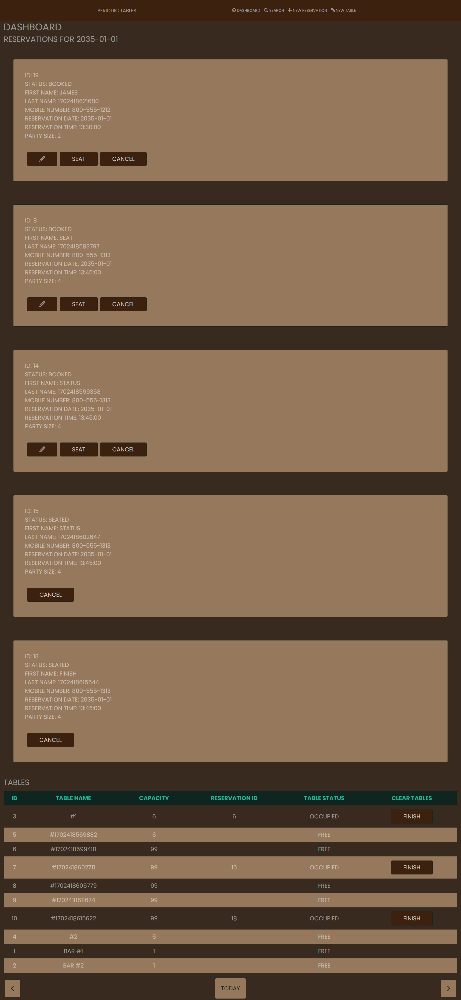
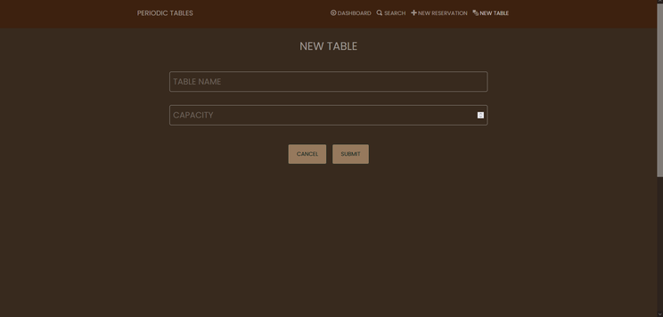
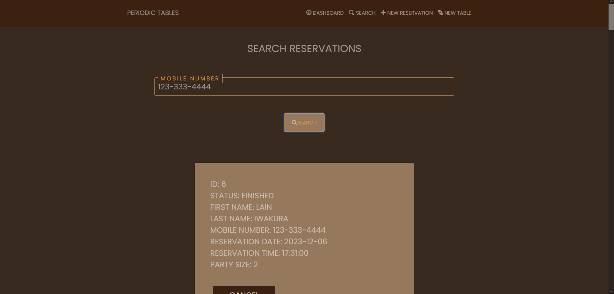
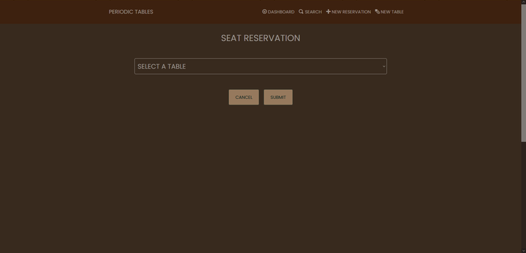

# Restaurant Reservation App

> Final Capstone Project for Thinkful's Software Engineering Program
> Deployed site can be viewed [here](https://restaurant-reservation-app-frontend-4eo8.onrender.com)

## File Setup

The table below describes the folders in this mono-repository:

| Folder/file path | Description                                                      |
| ---------------- | ---------------------------------------------------------------- |
| `./back-end`     | The backend project, which runs on `localhost:5001` by default.  |
| `./front-end`    | The frontend project, which runs on `localhost:3000` by default. |

## API documentation

This application uses PostgreSQL, knex, and Express to implement backend API functionality, and is set up with CORS to share resources with the frontend client. All routes not listed return `404: Not Found`.

### /reservations Route

This route handles all maintenance of `reservations` resource.

| URL path                               | Method   | Description                                                                                                                                                             |
| -------------------------------------- | -------- | ----------------------------------------------------------------------------------------------------------------------------------------------------------------------- |
| `/reservations`                        | `GET`    | Returns a list of all reservations by default, when `date` or `mobile_number` is passed as query parameters, returns a list of reservations for that date/mobile_number |
| `/reservations`                        | `POST`   | Creates a new reservation in the database                                                                                                                               |
| `/reservations/:reservation_id/status` | `PUT`    | Updates the status of an existing reservation to the specified status in request body                                                                                   |
| `/reservations/:reservation_id/status` | `DELETE` | Updates reservation status to `cancelled`                                                                                                                               |
| `/reservations/:reservation_id`        | `GET`    | Returns all data relating to a single specified reservation                                                                                                             |
| `/reservations/:reservation_id`        | `PUT`    | Updates an existing reservation based on request body data                                                                                                              |

### /tables Route

This route handles all maintenance of `tables` resource.

| URL path                 | Method   | Description                                                                                                                                                 |
| ------------------------ | -------- | ----------------------------------------------------------------------------------------------------------------------------------------------------------- |
| `/tables`                | `GET`    | Returns a list of all tables                                                                                                                                |
| `/tables`                | `POST`   | Creates a new table in the database                                                                                                                         |
| `/tables/:table_id/seat` | `PUT`    | Updates a given table's status to `Occupied` and assigns associated `reservation_id` to table, `reservation_id` must be passed as part of request body data |
| `/tables/:table_id/seat` | `DELETE` | Updates table status to `Free` and updates associated `reservation_id` to null, reservation matching `reservation_id` is also updated to status `finished`  |

## Frontend Client

The frontend client side of this application was built using React and CSS, and uses fetch calls to communicate with API. This application allows users to create, update, and seat reservations for our (fake) restaurant Periodic Tables. Tables available in the restaurant are also tracked in our database, allowing user to keep track of which tables are currently available to seat reservations and which are currently seated.

### Dashboard Page

  
Main page of application, displays a list of all reservations for the current day and restaurant tables. Current day can be changed by using the right and left arrow buttons and `TODAY` button at bottom of page, or through search queries. (ex. `/dashboard?date=01-23-2024`) Current day defaults to current date.

### New Reservation Page

  
Can be accessed by clicking `new reservation` button in header navbar. Displays a form to input a new reservation. Reservations cannot be made on Tuesdays, or before or after business hours for the restaurant. Attempting to submit a reservation that breaks any of these rules will result in an error from the API. Errors are displayed on page after response is sent from API.

### New Table Page

  
Can be accessed by clicking `new table` button in header navbar. Displays a form to input a new table to the database. Omitting either inputs results in an error from API, errors are displayed on page after response is sent from API.

### Search Page

  
Can be accessed by clicking `search` button in header navbar. Displays a search form with a mobile number input. Returns a list of reservations matching that phone number or `no reservations found` if the mobile number being searched returns no records from database.

### Seat Reservation Page

  
Can be accessed by clicking `SEAT` button on reservation display. Displays a form with a select element, with all tables as options. Selecting a table that is already occupied and submitting displays an error that the table is currently occupied. Selecting a table that is open and submitting the form updates the table status to `Occupied` and sets the selected reservation's `reservation_id` as the table's `reservation_id`, and takes the user back to the dashboard page.

### Edit Reservation Page

  
Can be accessed by clicking the button with a pencil icon on a reservation display on dashboard page. Displays the edit reservation form with current data for reservation filled in by default. Follows same validation as new reservation form. Only reservations with a status of `booked` can be edited.

### Finishing a Reservation

  
Clicking on the `FINISH` button in table display will display a window pop-up asking user to confirm this action. Confirming will update the reservation's `status` to `finished` and clear the table, updating table status to `Free` and clearing `reservation_id`. Canceling the dialog does nothing and brings user back to current page.

### Canceling a Reservation

  
Clicking on the `CANCEL` button in reservation display will dispay a window pop-up asking user to confirm this action. Confirming will update the reservation's status to `cancelled` and will hide it from the dashboard page. Canceling the dialog does nothing and returns the user to the current page.

## Installation

Want your own version of this app? Or just play around with the code? Follow these steps:

1. Fork and clone this repository
2. Navigate to root directory of cloned repository
3. Run `npm install` from root to install dependencies in both `/front-end` and `/back-end` directories
4. Make a PostgreSQL database(s) to connect to the backend
5. Copy `.env.sample` to `.env` in both `/front-end` and `/back-end` directories
6. In `/back-end/.env` fill in respective database information
7. Run `npm run start:dev` in root directory to start the development server! Starts backend with Nodemon
8. Running `npm run start` starts both backend and frontend server! Starts backend with Node
9. Run `npm run build` runs React build scripts in `/front-end`

## Technology Used

Project built using:

- Back end dependencies
  - CORS ^2.8.5
  - dotenv ^8.2.0
  - Express ^4.17.1
  - knex ^0.21.12
  - nanoid ^3.1.20
  - npm-run-all ^4.1.5
  - pg ^8.5.1
  - pino ^6.11.0
  - pino-http ^5.3.0
  - pino-pretty ^4.3.0
  - Jest ^26.6.3
  - nodemon ^2.0.6
  - supertest ^6.1.1
- Front end dependencies
  - Jest DOM testing library ^5.11.9
  - React testing library ^11.2.3
  - User event testing library ^12.6.0
  - React ^17.0.1
  - React Router ^5.2.0
  - React Router DOM ^5.2.0
  - React scripts ^4.0.1
  - npm-run-all ^4.1.5
  - Jest Puppeteer ^6.0.0
  - Puppeteer ^10.4.0
